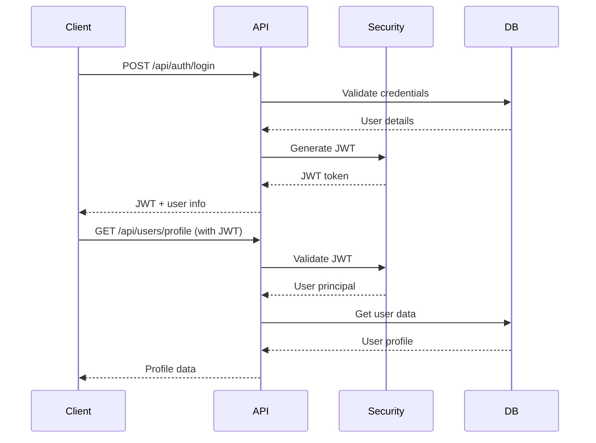

# Spring Boot RBAC API with JWT Authentication - Example Project

**🎓 This is an educational example and demonstration project showcasing Spring Boot security patterns and best practices.**

A comprehensive Spring Boot REST API **example** demonstrating **Role-Based Access Control (RBAC)** with **JWT authentication** and **enterprise-grade audit logging**. This project serves as a learning resource and reference implementation for real-world security concepts with Spring Security, JPA entities, and comprehensive testing following Test-Driven Development (TDD) principles.

> **⚠️ Important Notice**: This is a demonstration/example project designed for educational purposes and as a reference implementation. While it follows production-ready patterns and security best practices, it should be thoroughly reviewed and adapted before use in any production environment.

## Features

- **JWT Authentication**: Secure token-based authentication with real cryptographic signing
- **Role-Based Access Control (RBAC)**: Multi-level user permissions with role hierarchy
- **Comprehensive Audit Logging**: Enterprise-grade audit trail with IP tracking and user context
- **Real Database Integration**: JPA entities with H2 database (easily configurable for production databases)
- **Spring Security**: Complete security configuration with method-level security
- **AOP-Based Logging**: Automatic audit logging using Spring AOP with @Auditable annotation
- **Asynchronous Processing**: Non-blocking audit logging for optimal performance
- **Comprehensive Testing**: Unit and integration tests with 100% real implementations
- **Production-Ready Patterns**: Password encryption, account management, and security best practices
- **API Documentation**: Well-documented REST endpoints with proper HTTP status codes

## Table of Contents

- [Architecture](#architecture)
- [Audit Logging System](#audit-logging-system)
- [Quick Start](#quick-start)
- [API Endpoints](#api-endpoints)
- [Authentication Flow](#authentication-flow)
- [Role-Based Access Control](#role-based-access-control)
- [Database Schema](#database-schema)
- [Configuration](#configuration)
- [Testing](#testing)
- [Security Features](#security-features)
- [Deployment](#deployment)
- [Contributing](#contributing)

## 🏗️ Architecture

This application follows a layered architecture pattern:

```
┌─────────────────────┐
│   REST Controllers  │  ← HTTP endpoints with audit logging
├─────────────────────┤
│   Security Layer    │  ← JWT filters, RBAC
├─────────────────────┤
│   AOP Audit Layer   │  ← Automatic audit logging (@Auditable)
├─────────────────────┤
│   Service Layer     │  ← Business logic + Audit Service
├─────────────────────┤
│   Repository Layer  │  ← Data access + Audit Repository  
├─────────────────────┤
│   Database Layer    │  ← H2/PostgreSQL/MySQL + Audit Events
└─────────────────────┘
```

### Key Components

- **JwtService**: Handles JWT token generation, validation, and claims extraction
- **UserService**: Implements Spring Security's UserDetailsService with RBAC
- **🆕 AuditService**: Comprehensive audit logging with IP tracking and async processing
- **🆕 AuditAspect**: AOP-based automatic audit logging for methods annotated with @Auditable
- **SecurityConfig**: Configures Spring Security with custom JWT authentication
- **JwtAuthenticationFilter**: Custom filter for processing JWT tokens
- **User/Role/🆕AuditEvent Entities**: JPA entities with proper relationships and validation

## 📊 Audit Logging System

This example project includes a comprehensive audit logging system that demonstrates enterprise-grade tracking capabilities:

### Audit Features

- **Automatic Logging**: AOP-based logging using `@Auditable` annotation
- **Manual Logging**: Service-based logging for fine-grained control
- **IP Address Tracking**: Captures client IP addresses including proxy headers
- **User Context**: Tracks authenticated users and anonymous actions
- **Asynchronous Processing**: Non-blocking audit logging for performance
- **Rich Event Details**: Comprehensive event information with timestamps

### Audit Event Types

| Event Type | Actions | Description |
|------------|---------|-------------|
| `USER_REGISTRATION` | `REGISTER_ATTEMPT`, `REGISTER_SUCCESS`, `REGISTER_FAILURE` | User account creation |
| `USER_AUTHENTICATION` | `LOGIN_ATTEMPT`, `LOGIN_SUCCESS`, `LOGIN_FAILURE` | Authentication events |
| `USER_PROFILE` | `PROFILE_VIEW`, `PROFILE_UPDATE` | Profile access and modifications |
| `ADMIN_OPERATION` | `VIEW_ALL_USERS`, `DELETE_USER`, `VIEW_SYSTEM_STATS` | Administrative actions |

### Admin Audit Endpoints

| Method | Endpoint | Description | Access |
|--------|----------|-------------|---------|
| GET | `/api/audit/events` | List all audit events (paginated) | ADMIN |
| GET | `/api/audit/events/user/{username}` | Get user-specific audit events | ADMIN |
| GET | `/api/audit/events/search` | Search audit events by type/date | ADMIN |

### Example Audit Event

```json
{
  "id": 1,
  "eventType": "USER_AUTHENTICATION",
  "action": "LOGIN_SUCCESS", 
  "username": "john_doe",
  "details": "User login completed successfully. Roles: [USER]",
  "ipAddress": "192.168.1.100",
  "userAgent": "Mozilla/5.0 (Macintosh; Intel Mac OS X 10_15_7)",
  "timestamp": "2025-01-20T14:30:45.123",
  "status": "SUCCESS",
  "resourceType": null,
  "resourceId": null
}
```

### Using Audit Logging

#### Automatic Logging with @Auditable
```java
@PostMapping("/api/users/profile")
@Auditable  // ← Automatically logs method execution
@PreAuthorize("hasRole('USER')")
public ResponseEntity<?> updateProfile(@RequestBody ProfileRequest request) {
    // Method implementation
}
```

#### Manual Logging
```java
// Log specific events with detailed context
auditService.logEventForUser("USER_PROFILE", "PROFILE_UPDATE", 
    username, "Profile updated - email changed from old@example.com to new@example.com");

// Log events with status
auditService.logEvent("USER_AUTHENTICATION", "LOGIN_FAILURE", 
    "Login failed for user: " + username + " - invalid credentials", "FAILURE");
```

## 🚀 Quick Start

### Prerequisites

- Java 17 or higher
- Maven 3.8+
- Your favorite IDE (IntelliJ IDEA, VS Code, Eclipse)

### Installation

1. **Clone the repository**
   ```bash
   git clone https://github.com/yourusername/spring-rbac-example.git
   cd spring-rbac-example/spring-rbac-api
   ```

2. **Build the project**
   ```bash
   mvn clean compile
   ```

3. **Run tests**
   ```bash
   mvn test
   ```

4. **Start the application**
   ```bash
   mvn spring-boot:run
   ```

The API will be available at `http://localhost:8080`

### Quick Test

Register a new user:
```bash
curl -X POST http://localhost:8080/api/auth/register \
  -H "Content-Type: application/json" \
  -d '{
    "username": "john_doe",
    "email": "john@example.com", 
    "password": "securepass123"
  }'
```

Login to get JWT token:
```bash
curl -X POST http://localhost:8080/api/auth/login \
  -H "Content-Type: application/json" \
  -d '{
    "username": "john_doe",
    "password": "securepass123"
  }'
```

## 📚 API Endpoints

### Authentication Endpoints

| Method | Endpoint | Description | Access |
|--------|----------|-------------|---------|
| POST | `/api/auth/register` | Register new user | Public |
| POST | `/api/auth/login` | User login | Public |

### User Endpoints

| Method | Endpoint | Description | Access |
|--------|----------|-------------|---------|
| GET | `/api/users/profile` | Get current user profile | USER |
| PUT | `/api/users/profile` | Update user profile | USER |

### Admin Endpoints

| Method | Endpoint | Description | Access |
|--------|----------|-------------|---------|
| GET | `/api/admin/users` | List all users | ADMIN |
| DELETE | `/api/admin/users/{username}` | Delete user | ADMIN |
| GET | `/api/admin/stats` | Get system statistics | ADMIN |

### 🆕 Audit Endpoints

| Method | Endpoint | Description | Access |
|--------|----------|-------------|---------|
| GET | `/api/audit/events` | List all audit events (paginated) | ADMIN |
| GET | `/api/audit/events/user/{username}` | Get user-specific audit events | ADMIN |
| GET | `/api/audit/events/search` | Search audit events by type/date | ADMIN |

### Example Requests

#### Register User
```json
POST /api/auth/register
{
  "username": "alice_smith",
  "email": "alice@example.com",
  "password": "mypassword123"
}
```

**Response** (201 Created):
```json
{
  "id": 1,
  "username": "alice_smith",
  "email": "alice@example.com",
  "roles": ["USER"],
  "createdAt": "2025-08-30T20:15:30"
}
```

#### Login
```json
POST /api/auth/login
{
  "username": "alice_smith",
  "password": "mypassword123"
}
```

**Response** (200 OK):
```json
{
  "token": "eyJhbGciOiJIUzI1NiJ9.eyJzdWIiOiJhbGljZV9zbWl0aCIsImlhdCI6MTY5MzQyNzczMCwiZXhwIjoxNjkzNTE0MTMwfQ.signature",
  "username": "alice_smith",
  "roles": ["USER"],
  "expiresAt": "2025-08-31T20:15:30"
}
```

#### Access Protected Endpoint
```bash
curl -X GET http://localhost:8080/api/users/profile \
  -H "Authorization: Bearer YOUR_JWT_TOKEN"
```

## 🔐 Authentication Flow



## 🛡️ Role-Based Access Control

### Default Roles

| Role | Description | Permissions |
|------|-------------|-------------|
| **USER** | Standard user | Access own profile, update own data |
| **ADMIN** | Administrator | All USER permissions + user management |

### Role Hierarchy

```
ADMIN
  ├── Full system access
  ├── User management
  └── All USER permissions
      └── USER
          ├── Profile access
          └── Profile updates
```

### Method-Level Security

```java
@PreAuthorize("hasRole('USER')")
public ResponseEntity<UserProfile> getProfile() { ... }

@PreAuthorize("hasRole('ADMIN')")
public ResponseEntity<List<User>> getAllUsers() { ... }
```

## 🗄️ Database Schema

### Tables

```sql
-- Users table
CREATE TABLE users (
    id BIGINT PRIMARY KEY AUTO_INCREMENT,
    username VARCHAR(50) UNIQUE NOT NULL,
    email VARCHAR(255) UNIQUE NOT NULL,
    password VARCHAR(255) NOT NULL,
    enabled BOOLEAN DEFAULT true,
    account_non_expired BOOLEAN DEFAULT true,
    account_non_locked BOOLEAN DEFAULT true,
    credentials_non_expired BOOLEAN DEFAULT true,
    created_at TIMESTAMP DEFAULT CURRENT_TIMESTAMP,
    updated_at TIMESTAMP DEFAULT CURRENT_TIMESTAMP
);

-- Roles table
CREATE TABLE roles (
    id BIGINT PRIMARY KEY AUTO_INCREMENT,
    name VARCHAR(50) UNIQUE NOT NULL,
    description VARCHAR(255)
);

-- User-Role junction table
CREATE TABLE user_roles (
    user_id BIGINT,
    role_id BIGINT,
    PRIMARY KEY (user_id, role_id),
    FOREIGN KEY (user_id) REFERENCES users(id),
    FOREIGN KEY (role_id) REFERENCES roles(id)
);

-- 🆕 Audit Events table
CREATE TABLE audit_events (
    id BIGINT PRIMARY KEY AUTO_INCREMENT,
    event_type VARCHAR(100) NOT NULL,
    action VARCHAR(100) NOT NULL,
    username VARCHAR(100),
    details TEXT,
    ip_address VARCHAR(45),
    user_agent TEXT,
    timestamp TIMESTAMP DEFAULT CURRENT_TIMESTAMP,
    status VARCHAR(20),
    resource_type VARCHAR(100),
    resource_id BIGINT
);
```

### Entity Relationships

```
User ||--o{ UserRole }o--|| Role
User ||--o{ AuditEvent (by username)
```

## ⚙️ Configuration

### Application Properties

```yaml
# Database Configuration
spring.datasource.url=jdbc:h2:mem:rbacdb
spring.datasource.driverClassName=org.h2.Driver
spring.jpa.hibernate.ddl-auto=create-drop

# JWT Configuration
app.jwt.secret=mySecretKey
app.jwt.expiration=86400000  # 24 hours

# Security Configuration
spring.security.user.name=admin
spring.security.user.password=admin123
```

### Environment Variables

| Variable | Description | Default |
|----------|-------------|---------|
| `JWT_SECRET` | Secret key for JWT signing | Generated |
| `JWT_EXPIRATION` | Token expiration time (ms) | 86400000 |
| `DB_URL` | Database URL | H2 in-memory |
| `DB_USERNAME` | Database username | sa |
| `DB_PASSWORD` | Database password | (empty) |

## 🧪 Testing

### Test Coverage

- **Unit Tests**: 14 tests covering all business logic
- **Integration Tests**: End-to-end API testing
- **Security Tests**: Authentication and authorization scenarios

### Running Tests

```bash
# Run all tests
mvn test

# Run specific test class
mvn test -Dtest=JwtServiceTest

# Run with coverage
mvn test jacoco:report
```

### Test Categories

#### JWT Service Tests (6 tests)
- Token generation and validation
- Claims extraction
- Expiration handling
- Invalid token scenarios

#### User Service Tests (8 tests)
- User creation and authentication
- Role-based access control
- Password encryption
- User management operations

### Example Test

```java
@Test
void shouldGenerateValidJwtToken() {
    // Given
    String username = "testuser";
    
    // When
    String token = jwtService.generateToken(username);
    
    // Then
    assertThat(token).isNotNull();
    assertThat(jwtService.extractUsername(token)).isEqualTo(username);
    assertThat(jwtService.isTokenValid(token, username)).isTrue();
}
```

## 🔒 Security Features

### Password Security
- **BCrypt hashing** with salt rounds
- **Minimum length requirements** (8 characters)
- **Password validation** on registration

### JWT Security
- **HMAC-SHA256 signing** algorithm
- **Configurable expiration** times
- **Secure claims handling**
- **Token validation** on every request

### Account Security
- **Account status flags** (enabled, expired, locked)
- **Credential expiration** tracking
- **Role-based method security**

### Protection Against
- **CSRF attacks** (stateless JWT)
- **Session fixation** (no sessions)
- **Brute force** (can be extended with rate limiting)
- **SQL injection** (JPA with parameterized queries)

## 🚀 Deployment

### Docker Deployment

1. **Create Dockerfile**
   ```dockerfile
   FROM openjdk:17-jdk-slim
   COPY target/spring-rbac-api-1.0-SNAPSHOT.jar app.jar
   EXPOSE 8080
   ENTRYPOINT ["java", "-jar", "/app.jar"]
   ```

2. **Build and run**
   ```bash
   mvn clean package
   docker build -t spring-rbac-api .
   docker run -p 8080:8080 spring-rbac-api
   ```

### Production Configuration

```yaml
# application-prod.yml
spring:
  datasource:
    url: jdbc:postgresql://localhost:5432/rbacdb
    username: ${DB_USERNAME}
    password: ${DB_PASSWORD}
  jpa:
    hibernate:
      ddl-auto: validate
    show-sql: false

app:
  jwt:
    secret: ${JWT_SECRET}
    expiration: 3600000  # 1 hour in production

logging:
  level:
    com.example.rbac: INFO
```

## 🛠️ Technology Stack

- **Framework**: Spring Boot 3.1.5
- **Security**: Spring Security 6.0
- **🆕 AOP**: Spring AOP (for audit logging)
- **🆕 Async Processing**: Spring's @Async for non-blocking audit logging
- **Database**: H2 (dev), PostgreSQL/MySQL (prod)
- **ORM**: Spring Data JPA / Hibernate
- **Authentication**: JWT (jjwt library)
- **Testing**: JUnit 5, MockMvc
- **Build Tool**: Maven
- **Java Version**: 17+

## 📈 Performance Considerations

- **Stateless authentication** for horizontal scaling
- **Database connection pooling** (HikariCP)
- **Lazy loading** for entity relationships
- **Pagination support** for large datasets
- **Caching strategies** (can be extended with Redis)

## 🐛 Troubleshooting

### Common Issues

1. **JWT Token Invalid**
   - Check token expiration
   - Verify JWT secret configuration
   - Ensure proper Bearer token format

2. **Access Denied (403)**
   - Verify user has required roles
   - Check @PreAuthorize annotations
   - Confirm user account is enabled

3. **Database Connection Issues**
   - Verify database URL and credentials
   - Check if database server is running
   - Review connection pool settings

## 🤝 Contributing

This is primarily an **educational example project** designed to demonstrate Spring Security and audit logging patterns. However, contributions that improve the educational value or add new demonstration features are welcome!

1. Fork the repository
2. Create a feature branch (`git checkout -b feature/amazing-feature`)
3. Write tests for your changes
4. Ensure all tests pass (`mvn test`)
5. Commit your changes (`git commit -m 'Add amazing feature'`)
6. Push to the branch (`git push origin feature/amazing-feature`)
7. Open a Pull Request

### Development Guidelines

- Follow Test-Driven Development (TDD)
- Write comprehensive tests
- Use meaningful commit messages
- Update documentation for new features
- Maintain code coverage above 80%
- Keep the educational nature of the project in mind

## ⚠️ Production Usage Disclaimer

**Important**: This is a demonstration and example project. While it follows security best practices and production-ready patterns, it should be thoroughly reviewed, tested, and adapted before considering any production use. Key considerations for production:

- Review and strengthen JWT configuration
- Implement rate limiting and brute force protection
- Add comprehensive input validation and sanitization
- Configure production-grade database with proper indexing
- Implement proper logging and monitoring
- Add backup and disaster recovery procedures
- Conduct security audits and penetration testing

## 📝 License

This project is licensed under the MIT License - see the [LICENSE](LICENSE) file for details.

## 🙏 Acknowledgments

- Spring Boot team for the excellent framework
- Spring Security for robust security features
- JWT.io for JWT token standards
- H2 Database for development convenience

